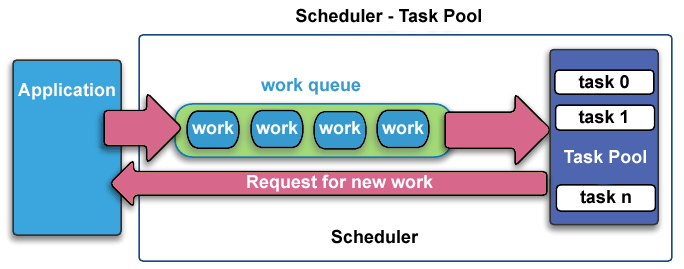

# Job manager

## 1. Introduction

Job is a task assigned to another application (called service application) to perform. When the task is done, the service application will return the result to main web application.

To mamage jobs, there are some concepts:

* Service application and service
* Job and job log
* Job definition and attributes

## 2. How the job operate

## 3. GUI to control job

## 4. Jobs

### Job manual one time running

Run ONE TIME only. The web application add the job to **job table** and the service application process the job. The service application will add **Job log** and update the job status after finish

 Attribute|Value|Note
---|:---:|---
System|0| Not a system job
Interval| null
Inactive| 0

### Job manual

Run many time by user. The user (normallly admin) come to the Job management screen to run the job. The job is used to some tasks like purging data manually

 Attribute|Value|Note
---|:---:|---
**System**|**1**| **Must be a system job**
Interval| null
Inactive| 0

### Job automatic

Job runs by schedules in interval fields. Based on the interval the job will runs every minute, hour , day, etc

See cron format at [http://www.nncron.ru/help/EN/working/cron-format.htm](http://www.nncron.ru/help/EN/working/cron-format.htm)

 Attribute|Value|Note
---|:---:|---
**System**|**1**| **Must be a system job**
**Interval**|**String (not null)**| Eg. \*/5 \* \* \* \* \* Run every 5 minutes
Inactive| 0

## Service job list

Service name|Method name|Parameters|Type|Notes|Projects
---|---|---|---|---|---
**BIS Service** .bis|process|pathFolder|Read MYOB|Update MYOB service. Read folder query to update data from MYOB Classic to MySQL database|pt-crm, report-framework
|processRoi|investment uuid, month, year, purchase date|Write MYOB|Insert ROI purchase to MYOB Classic|pt-crm
|approve|investment uuid|Write MYOB|Insert invoice to MYOB Classic|pt-crm
|payOnCustomer|customer uuid, payment date|Write MYOB|Insert purchase payment to MYOB classic|pt-crm
||||  
**Document Service** .document|callMethod|template id, object data id, is created document, document id|Generate document|Generate template including PDF file (based on .rpt Crystal report) and Doc file (based Word document file - Freemaker)|framework
|||
**Email Service** .email|callMethod|template id, object id, template content, mailbox id, email to|Send email|Send email| framework
|||
**ImportFile Service** .importfile|importFile|Parameter using json style|Import file|Import for all object|framework
|importRoiFile|Parameter using json style|Import file|Import ROI data | pt-crm
|||
**XML Service** .runxml|process|pathFolder|Update database|Process query in XML file in the pathFolder|framework
|process|pathFolder|Update database|customer_loader_rules|pt-crm
|process|pathFolder|Update database|investment_rule|pt-crm
|process|pathFolder|Update database|customer_rule|pt-crm
|newRoi|pathFolder, month, year|Update database|Create new ROI for new month|pt-crm
|||
**Mass Update Service**|-|-|Mass Update|Mass update object|framework
|||
**Rule service** .rule|-|-|Rule update|Trigger action based on object update|framework
|||
**Object service** .generateclass|-|-|Generate module class|Generate module class source code in Development tools|framework

## Coding notices

### Get jobs which are requested run

Atrribute|Value
---|---
**Updated** 	| Job requested to run
**Inactive**	| 1: disable job  0: active job
**Interval**	| not null: automatic job  null: manual job
**System**		| 0: one time job 1: system job, can not be deleted by user

Get jobs which are requested run

1. Job manual: Job is active and updated = true
2. Job automatic: Job is active and no need updated . Need to add to schedule the job
3. Job automatic forced to run: Job is active and updated is true. 

### Update jobs when service restarts

1. Stop all **Job manual one time running**
2. Rerun **Job manual**
3. Stop all **Job automatic**

